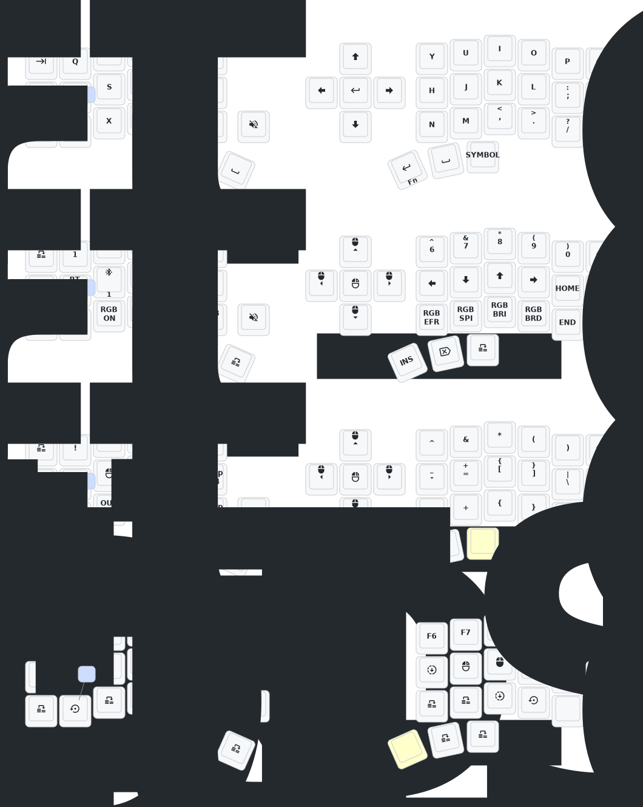

Eyelash Corne ZMK Repo
## Keymap Diagram

## Notes
- press and hold Q, S and Z simultaneously for 2 seconds to put into deep sleep state. awaken by pressing reset button

( custom corne, will not work with [foostan's Corne](https://github.com/foostan/crkbd) )
